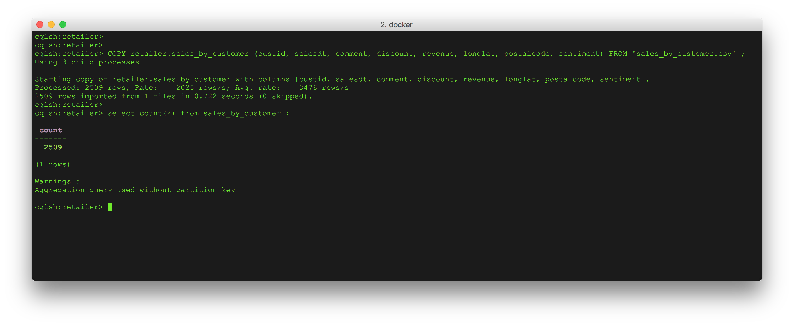
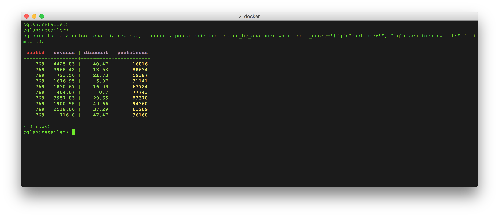
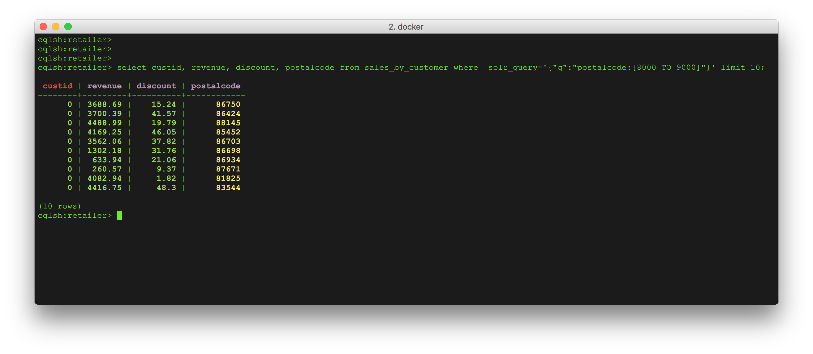
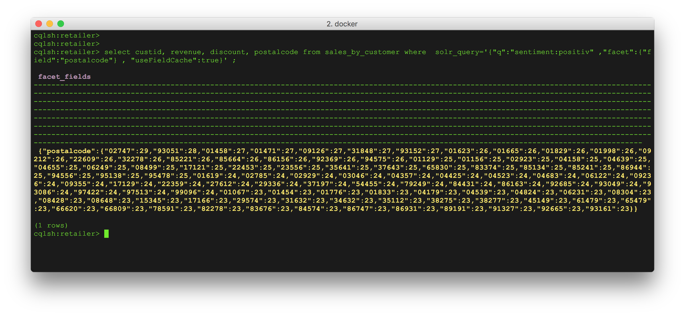

**[Back to Agenda](./../README.md)**


# Lab 5 - Search

## Search Essentials

DSE Search is awesome. You can configure which columns of which Cassandra tables you'd like indexed in Lucene format to make extended searches more efficient while enabling features such as text search and geospatial search.

First import some more data to the table we've already made. For this please use the COPY command in cqlsh to import a CSV data into the sales_by_customer table.


Please start to copy the repository first:
```
git clone https://github.com/norim/DataStaxDay
cd DataStaxDay/data
```

** You can find the file sales_by_customer.csv under DataStaxDay/data/ **

Start `cqlsh` commandline and follow the instructions.
```
use <your_keyspace>;

COPY sales_by_customer (custid, salesdt, comment, discount, revenue, longlat, postalcode, sentiment) FROM 'sales_by_customer.csv' ;

```



**Functional queries:**

1. For a given custid, get all orders

2. For a given custid, get all orders in a specific date range

3. For a given custid, get all orders with a 'positve' sentiment

4. For a given custid, get all orders with discount greater then 15.0

5. For a given custid, get all orders with revenue greater then 3000 and a discount less then 30.0


Functional query from 1-5

```
select salesdt,revenue,discount,postalcode,longlat,sentiment from sales_by_customer where custid = 769;

select salesdt,revenue,discount,postalcode,longlat,sentiment from sales_by_customer where custid = 769 and salesdt > '2017-01-01' and salesdt < '2018-01-01';

select salesdt,revenue,discount,postalcode,longlat,sentiment from sales_by_customer where custid = 769 and sentiment='positiv' ALLOW FILTERING;

select salesdt,revenue,discount,postalcode,longlat,sentiment from sales_by_customer where custid = 769 and discount>15 ALLOW FILTERING;

select salesdt,revenue,discount,postalcode,longlat,sentiment from sales_by_customer where custid = 769 and revenue>3000 and discount<30 ALLOW FILTERING;
```

Now lets find the answer of the following functional queries.

6. For a given sentiment, get all orders


Let's start off by indexing the tables we've already made. Here's where DSE Search really comes in handy.  From cqlsh on one of your nodes run:

```
use retailer;

CREATE SEARCH INDEX IF NOT EXISTS ON sales_by_customer WITH COLUMNS sentiment;

```
Anyone familiar with Solr knows that there's a REST API for querying data. In DSE Search, we embed that into CQL so you can take advantage of all the goodness CQL brings. Let's give it a shot.


**Filter Queries**    
Now lets check the functional query with a solr query again:


```
select salesdt,revenue,discount,postalcode,longlat,sentiment from sales_by_customer where  solr_query='{"q":"sentiment:positiv"}';
```

or **Wildcard**

```

select salesdt,revenue,discount,postalcode,longlat,sentiment from sales_by_customer where  solr_query='{"q":"sentiment:po*"}';

```

or **Negation**

```

select salesdt,revenue,discount,postalcode,longlat,sentiment from sales_by_customer where solr_query='{"q":"custid:769", "fq":"-sentiment:posi*"}';

```    




To answer the following functional query we might need to index another column

7. For a given region, get all orders with a revenue greater 2000

Now add the postalcode column to the indexing

```
ALTER SEARCH INDEX SCHEMA ON sales_by_customer ADD field postalcode;
RELOAD SEARCH INDEX ON retailer.sales_by_customer;
REBUILD SEARCH INDEX ON sales_by_customer WITH OPTIONS { deleteAll:false };
```
**Range Query**    
Now lets check the functional query with a solr query again:    

```
select custid, revenue, discount, postalcode from sales_by_customer where  solr_query='{"q":"postalcode:[8000 TO 9000]"}';

```




**Facet Search**    
Lets check how many orders with positive sentiment are in the postalcodes:   

```

select custid, revenue, discount, postalcode from sales_by_customer where  solr_query='{"q":"sentiment:positiv" ,"facet":{"field":"postalcode"} , "useFieldCache":true}' ;
```




If you've ever created your own Solr cluster, you know you need to create the core and upload a schema and config.xml. That generateResources tag does that for you. For production use, you'll want to take the resources and edit them to your needs but it does save you a few steps.


**As a side note:**   
Similar to what we've done on cqlsh you can run the dsetool on the command line e.g. dsetool create_core retailer.sales generateResources=true reindex=true
You can update the schema and reload the configuration and schema.

This by default will map Cassandra types to Solr types for you.  I

For Geo Spatial Search you need to update the schema similar to the example in the docs:
https://docs.datastax.com/en/dse/5.1/dse-admin/datastax_enterprise/search/queriesGeoSpatial.html


For your reference, here's the doc that shows some of things you can do: http://docs.datastax.com/en/dse/5.1/dse-admin/datastax_enterprise/search/queriesAbout.html

Want to see a really cool example of a live DSE Search app? Check out [KillrVideo](http://www.killrvideo.com/) and its [Git](https://github.com/luketillman/killrvideo-csharp) to see it in action.

**[Back to Agenda](./../README.md)**
